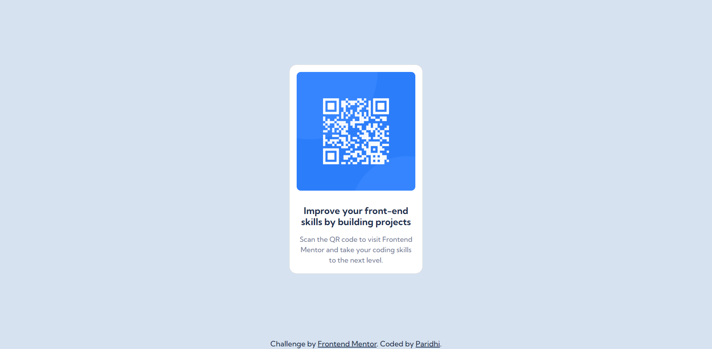

# Frontend Mentor - QR code component solution

This is a solution to the [QR code component challenge on Frontend Mentor](https://www.frontendmentor.io/challenges/qr-code-component-iux_sIO_H).

## Table of contents

- [Overview](#overview)
  - [Screenshot](#screenshot)
  - [Links](#links)
- [Built with](#built-with)
- [Author](#author)

## Overview

### Screenshot

### Links

- Solution URL: https://github.com/paridhi3/QR-Code-Component
- Live Site URL: https://paridhi3.github.io/QR-Code-Component/

## Built with

- Semantic HTML5 markup
- CSS custom properties
- Bootstrap
- Flexbox

## Author

- Website - //
- Frontend Mentor - [@paridhi3](https://www.frontendmentor.io/profile/paridhi3)
- Twitter - [@wittywimp](https://twitter.com/wittywimp)
